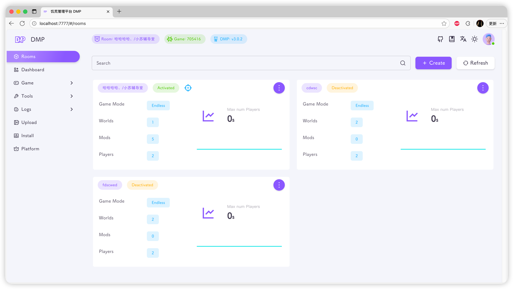
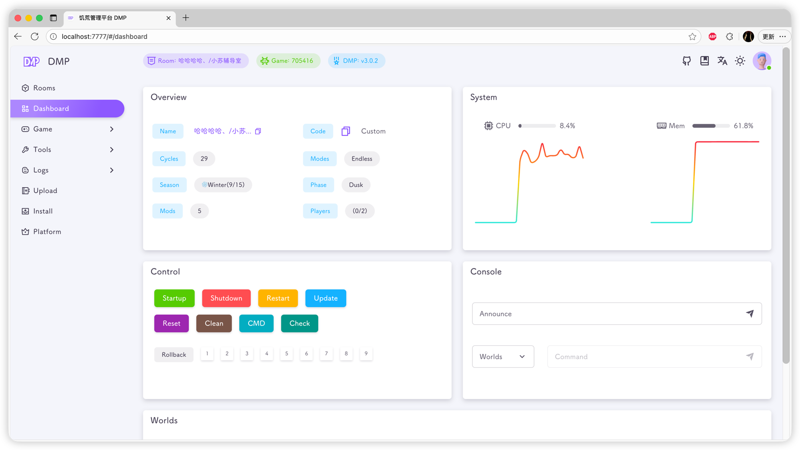
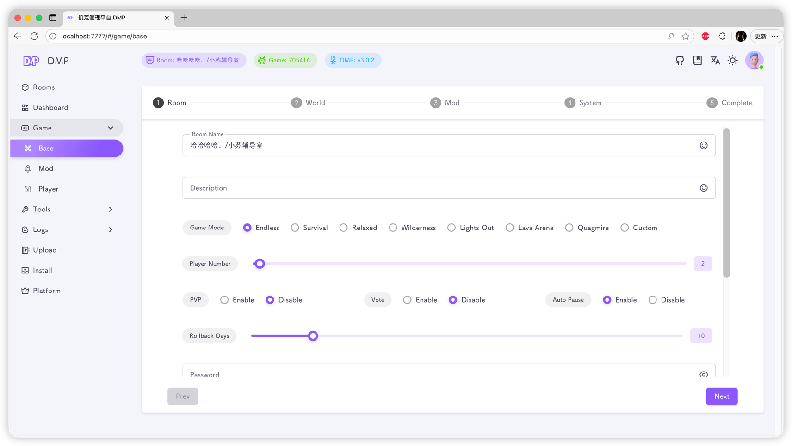
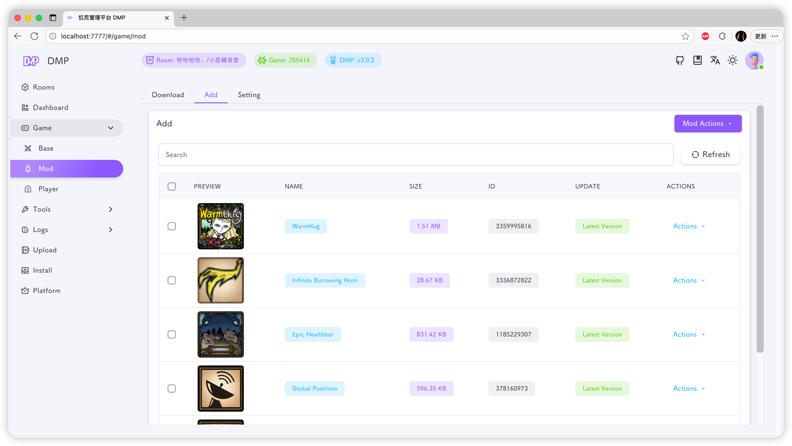
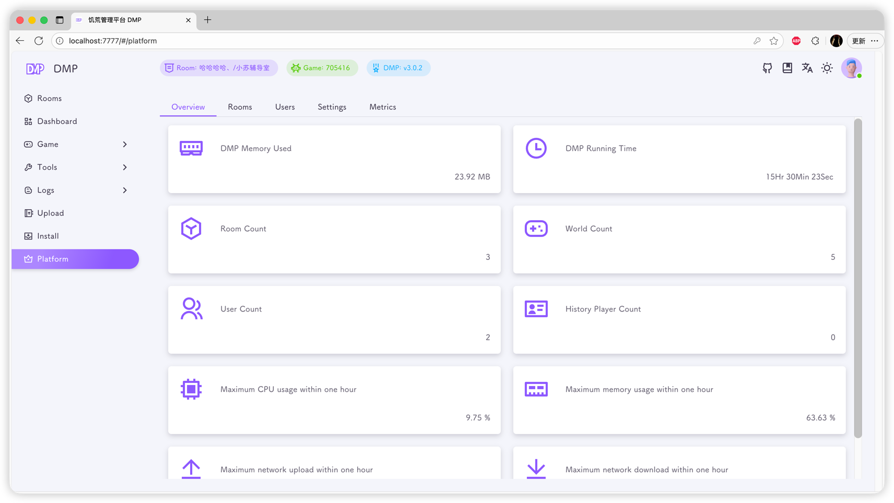

### [[中文文档](../README.md)] | [README]

# DMP

    
    <h3>:sparkling_heart: Supports multi-room, multi-user, and multi-permission management :sparkling_heart:</h3>
    <h3>:star2: One-click to start your DST journey :star2:</h3>

---

## :strawberry: Documents

**[https://miraclesses.top](https://miraclesses.top)**

---

## :love_letter: Contribute

Welcome all developers to contribute code to improve and extend this project!

Thanks to the following developers for their code contributions to this project.

---

## :balloon: Screenshots

---

##  :sparkling_heart: Thanks
The [frontend](https://github.com/miracleEverywhere/dst-management-platform-web) of this project is a secondary development based on the open-source [materio-vuetify-vuejs-admin-template-free](https://github.com/themeselection/materio-vuetify-vuejs-admin-template-free). Many thanks to the open-source community

Versions 1.x and 2.x are based on secondary development of [koi-ui](https://github.com/KoiKite/koi-ui). Thanks to the open-source community

Thanks to the acceleration site: 
- [github.akams.cn](https://github.akams.cn/)
- [gh.llkk.cc](https://gh.llkk.cc/)
- [github.dpik.top](https://github.dpik.top/)
- [ghfast.top](https://ghfast.top/)

Thanks to [饥荒百科](https://dontstarve.huijiwiki.com/wiki/饥荒)

Thanks to [长鸽门徒](https://www.bilibili.com/opus/814456568458248259) for providing the DST emoji font